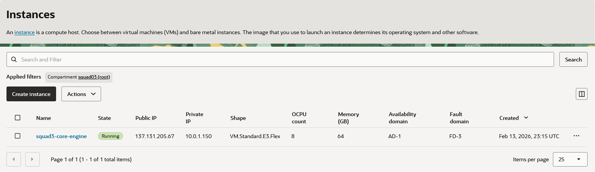
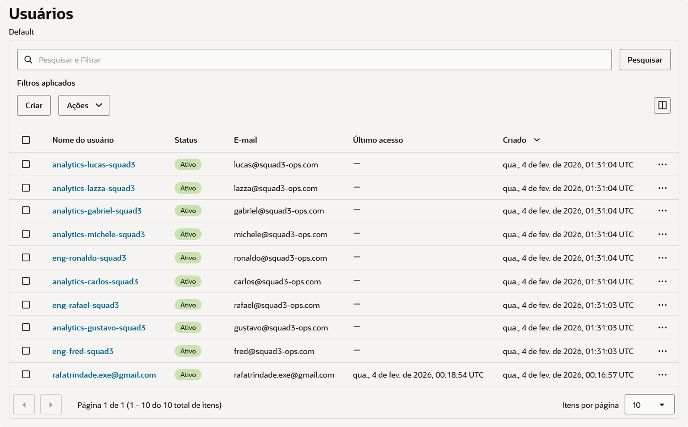
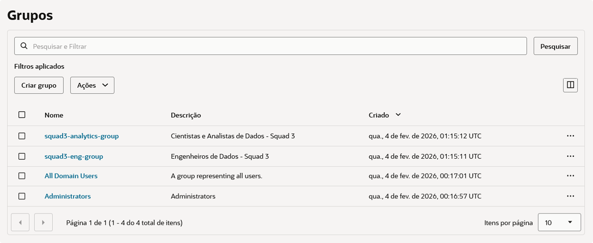
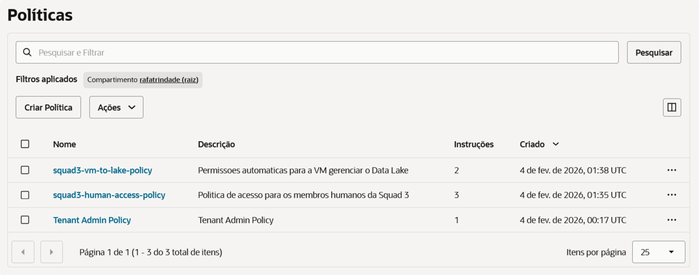
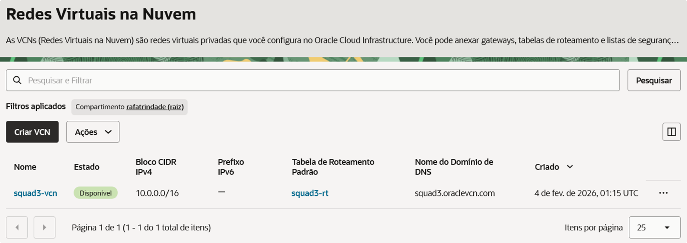
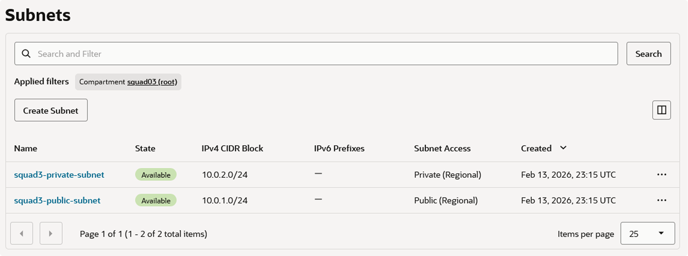
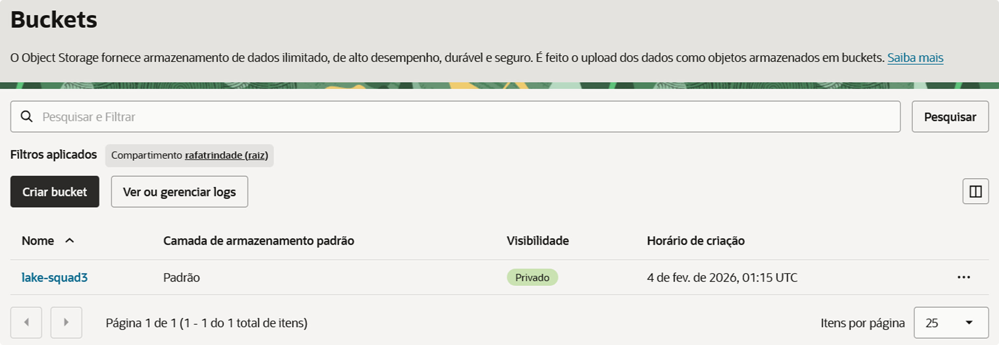

Repositório de desenvolvimento, documentação e implementação técnica da camada operacional da solução integrada de dados para o Hackathon da Pod Academy - Squad 3.

> Este repositório centraliza o provisionamento de infraestrutura como código (IaC), a orquestração dos pipelines e os mecanismos de ingestão e execução em nuvem, viabilizando a operação da arquitetura em ambiente Oracle Cloud Infrastructure (OCI).

---

### 🔗 Ecossistema Squad 3

* **Repositório 1 de 2 (Core):** [hackathon-pod-squad3-core](https://github.com/rafa-trindade/hackathon-pod-squad3-core) - _Engine de processamento, arquitetura medalhão e gestão de performance com governança de dados nativa._
* **Repositório 2 de 2 (Ops):** [hackathon-pod-squad3-ops](https://github.com/rafa-trindade/hackathon-pod-squad3-ops) - _Infraestrutura como código (IaC), orquestração de pipelines e estratégias de Cloud Readiness._

> 🔐 O Core define **o que** a arquitetura executa.  
> ⚙️ O Ops define **como e onde** ela é executada.

---

### 🔄 O Ciclo de Vida: Do *Core* ao *Ops*

A arquitetura separa a **engine de processamento** da **sustentação de infraestrutura**, aplicando estratégias de **Cloud Readiness** para garantir escalabilidade, governança nativa e alta disponibilidade:

> **Fase 1 (Core):**
> * **🧠 A Engine de Processamento:** Responsável pela lógica de negócio e transformação. Atua como o **Worker** que executa a arquitetura Medallion e garante a integridade dos dados através de processamento vetorial (DuckDB). É o motor de execução agnóstico à infraestrutura, onde residem os contratos de dados e as regras de qualidade.

---

> **Fase 2 (Ops):**
>* **🏗️ O Provisionamento (IaC):** O Ops entra em cena via **Terraform**, erguendo uma infraestrutura segura e resiliente na **OCI**. Através de **Instance Principals**, a VM ganha identidade própria, eliminando a necessidade de gerenciar chaves manuais e garantindo acesso nativo e seguro ao Object Storage.
>* **⚡ A Integração & Bootstrap:** No momento do deploy, o Ops realiza o bootstrap automatizado utilizando **Docker Compose**. O Airflow assume a responsabilidade de sincronizar os repositórios, enquanto o **Core é montado como um volume persistente dentro dos containers (Workers)**. Isso funde a lógica de negócio à capacidade de escala da nuvem, permitindo atualizações de inteligência e transformações sem a necessidade de redeploy da infraestrutura.
>* **🎼 A Orquestração (Airflow):** O **Apache Airflow** assume o papel de maestro. Ele gerencia as DAGs que executam desde a ingestão (Bridge para OCI Object Storage) até o acionamento dos módulos do Core para transformar dados brutos em insights na camada Gold, fechando o ciclo de entrega de ponta a ponta.
>
> ---
>
> 💡 **Nota de Decisão Arquitetural (Cloud Readiness):** 
> Embora a OCI ofereça serviços gerenciados como *OCI Container Instances* e *OKE (Kubernetes)*, optamos estrategicamente pela execução via **Docker Compose dentro de OCI Compute**. Esta decisão foi tomada para garantir a **Portabilidade Total (Cloud Readiness)**: a solução não possui "lock-in" com serviços proprietários de orquestração da nuvem, permitindo que todo o ecossistema (Airflow + Workers + Ingestão) seja migrado para qualquer provedor Cloud ou ambiente On-premises apenas movendo o arquivo de composição, mantendo a simplicidade operacional sem sacrificar o isolamento de processos.

---

### 📖 Navegação Técnica (Documentação)

### 🏗️ Arquitetura de Dados e Cloud Readiness
> 📑 [`docs/data_architecture/*`](docs/data_architecture/README.md)  
> **Consolida** a estratégia de separação entre o motor de processamento agnóstico (Core/DuckDB) e a plataforma de execução (Ops/OCI). **Define** as 4 fases do ciclo de vida operacional - do provisionamento à orquestração - garantindo portabilidade total via Docker Compose e segurança nativa através de *Instance Principals*.

---

### ☁️ Infraestrutura como Código (IaC)
> 📑 [`docs/infrastructure/*`](docs/infrastructure/README.md)  
> **Consolida** o provisionamento automatizado da stack tecnológica na Oracle Cloud via Terraform. **Define** a topologia de rede (VCN/Subnets), o armazenamento em Object Storage e a configuração de instâncias otimizadas para alta performance in-memory, utilizando *Cloud-Init* para o bootstrap imediato do ambiente.

---

### ⚡ Orquestração e Observabilidade
> 📑 [`docs/orchestrator/*`](docs/orchestrator/README.md)  
> **Consolida** o Workflow Management através do Apache Airflow, governando o ciclo de vida das DAGs de bootstrap, ingestão e pipeline. **Define** o controle de linhagem via Run ID e a automação da política de retenção das camadas Medallion, integrando telemetria em tempo real através do Painel de Observabilidade (Streamlit).

---

### 🚀 Setup, Deploy e Governança de Acessos
> 📁 [`docs/setup/*`](docs/setup/)  
> **Consolida** os procedimentos operacionais para deploy da infraestrutura e configuração do ambiente de orquestração. **Define** os protocolos de segurança para administração de identidades (IAM) na OCI e fornece guias de integração para usuários de dados, garantindo o isolamento de perfis entre engenharia e analytics.

* 📑 **Guias:** [`Guia de Deploy`](docs/setup/deployment.md) | [`Guia de Acessos (Admin)`](docs/setup/admin_guide.md) | [`Guia do Usuário (Analytics)`](docs/setup/users_guide.md)

---

### 📋 Governança Operacional (Gestão de Backlog)

>A governança das atividades é realizada por meio de quadros Kanban no **GitHub Projects**, integrando planejamento execução e versionamento. Esta divisão garante especialização técnica e transparência no progresso das frentes:   
>
> * 🚦 **GitHub Projects:** [`squad3-analytics`](https://github.com/users/rafa-trindade/projects/6) | [`squad3-engineering-core`](https://github.com/users/rafa-trindade/projects/4) | [`squad3-engineering-ops`](https://github.com/users/rafa-trindade/projects/8)

---

## 🛠️ Stack & Estratégia de Hardware

A arquitetura de processamento foi desenhada em duas fases para otimização de performance e custos:

---

### **Fase 1: Sandbox & Testes**
* **Shape:** `VM.Standard.A1.Flex` (ARM Ampere)
* **Recursos:** 4 OCPUs | 24GB RAM
* **Custo:** Always Free Tier (OCI)

---

### **Fase 2: Produção Oficial (Patrocinado) - Atual**
* **Shape:** `VM.Standard.E3.Flex` (AMD EPYC™)
* **Recursos:** 8 OCPUs | 64GB RAM (Escalável)
* **Objetivo:** Alta performance para o motor DuckDB e paralelismo total de DAGs.

---

## 🚀 Status do Provisionamento (Produção Oficial) - 100% Operacional

A infraestrutura do **Squad 3** evoluiu da fase de testes para o ambiente de **Produção Oficial (Patrocinado)**. O provisionamento via Terraform foi concluído com a migração para instâncias de alta performance, garantindo o paralelismo total das DAGs e otimização do motor DuckDB.

---

| Recurso | Status | Descrição |
| :--- | :---: | :--- |
| **Identity (IAM)** | 🟢 | Governança completa com Dynamic Groups e Policies de Produção. |
| **Networking** | 🟢 | VCN e Subnets otimizadas para tráfego de alta carga. |
| **Object Storage** | 🟢 | Bucket `lake` operacional (Camadas Medallion). |
| **Compute Instance**| 🟢 | **Instância AMD EPYC (8 OCPUs / 64GB) ativa e em produção.** |
| **Data Bridge** | 🟢 | Ingestão Raw (MinIO → OCI) em regime de produção. |
| **Orchestration** | 🟢 | Airflow operando com paralelismo total de DAGs. |

---

### 📸 Evidências de Provisionamento (Console OCI)

#### 1. Computação: Instância de Produção (High Performance)

*Implementação do Shape E3 (AMD EPYC) para suportar o processamento intensivo do motor DuckDB.*

---

#### 2. Governança: Usuários (IAM)

*Criação de usuários individuais para garantir a rastreabilidade e o controle de ações no ambiente.*

 

---

#### 3. Governança: Grupos de Trabalho

*Organização dos membros em grupos para a aplicação automatizada de acessos e permissões.*

 

---

#### 4. Governança: Políticas de Acesso (Policies)

*Políticas de segurança de "Menor Privilégio" aplicadas aos recursos de produção.*

 

---

#### 5. Rede: Virtual Cloud Network (VCN)

*Infraestrutura de rede isolada, garantindo a segurança e o controle do tráfego para o Squad 3.*

---

#### 6. Rede: Subnet Pública e Roteamento

*Segmentação lógica configurada para garantir a conectividade e o acesso externo ao orquestrador.*

---

#### 7. Data Lake: OCI Object Storage

*Bucket 'lake-squad3' operacional, garantindo o armazenamento e a disponibilidade de todas as camadas da Arquitetura Medallion.*

---

## 📂 Localização dos Projetos na VM (Cloud Path)

Após o provisionamento e o bootstrap via `cloud-init`, os projetos são organizados para garantir a separação entre orquestração e processamento:

* **📍 Raiz da Aplicação:** `/home/opc/app/`
* **⚙️ Camada Ops (Orquestração):** `/home/opc/app/hackathon-pod-squad3-ops/`
    * _Residência de Dockerfiles, Airflow DAGs e scripts de ingestão._
* **🔐 Camada Core (Processamento):** `/home/opc/app/hackathon-pod-squad3-core/`
    * _Residência do motor DuckDB e regras de governança (Medallion)._
* **⚡ Temp Path:** `/mnt/nvme/duckdb_temp`
    * _Diretório temporário em NVMe dedicado a operações intermediárias do DuckDB (spill, sort, joins pesados)._

