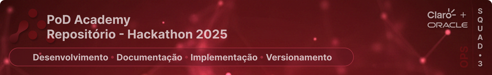

Repositório de desenvolvimento, documentação e implementação técnica da camada operacional da solução integrada de dados para o Hackathon da Pod Academy - Squad 3.

> Este repositório centraliza o provisionamento de infraestrutura como código (IaC), a orquestração dos pipelines e os mecanismos de ingestão e execução em nuvem, viabilizando a operação da arquitetura em ambiente Oracle Cloud Infrastructure (OCI).

---

### 🔗 Ecossistema Squad 3

* **Repositório 1 de 2 (Core):** [hackathon-pod-squad3-core](https://github.com/rafa-trindade/hackathon-pod-squad3-core) - _Engine de processamento, arquitetura medalhão e gestão de performance com governança de dados nativa._
* **Repositório 2 de 2 (Ops):** [hackathon-pod-squad3-ops](https://github.com/rafa-trindade/hackathon-pod-squad3-ops) - _Infraestrutura como código (IaC), orquestração de pipelines e estratégias de Cloud Readiness._

> 🔐 O Core define **o que** a arquitetura executa.  
> ⚙️ O Ops define **como e onde** ela é executada.

---

### 🔄 O Ciclo de Vida: Do *Core* ao *Ops*

A arquitetura separa a **engine de processamento** da **sustentação de infraestrutura**, aplicando estratégias de **Cloud Readiness** para garantir escalabilidade, governança nativa e alta disponibilidade:

* **🧠 A Inteligência (Core):** Responsável pela lógica de negócio e transformação. É onde reside a **Engine de Processamento** que executa a arquitetura Medallion e garante a integridade dos dados. O Core possui **governança nativa**, sendo agnóstico à infraestrutura e funcionando como o motor de inteligência que define as regras de transformação e qualidade.
* **🏗️ O Provisionamento (IaC):** O Ops entra em cena via **Terraform**, erguendo uma infraestrutura segura e resiliente na **OCI**. Através de **Instance Principals**, a VM ganha identidade própria, eliminando a necessidade de gerenciar chaves manuais e garantindo acesso nativo e seguro ao Object Storage.
* **⚡ A Integração & Bootstrap:** No momento do deploy, o Ops realiza o bootstrap automatizado utilizando **Docker Compose**. O Airflow assume a responsabilidade de sincronizar os repositórios, enquanto o **Core é montado como um volume persistente dentro dos containers (Workers)**. Isso funde a lógica de negócio à capacidade de escala da nuvem, permitindo atualizações de inteligência e transformações sem a necessidade de redeploy da infraestrutura.
* **🎼 A Orquestração (Airflow):** O **Apache Airflow** assume o papel de maestro. Ele gerencia as DAGs que executam desde a ingestão (Bridge para OCI Object Storage) até o acionamento dos módulos do Core para transformar dados brutos em insights na camada Gold, fechando o ciclo de entrega de ponta a ponta.

> 💡 **Nota de Decisão Arquitetural (Cloud Readiness):** 
> Embora a OCI ofereça serviços gerenciados como *OCI Container Instances* e *OKE (Kubernetes)*, optamos estrategicamente pela execução via **Docker Compose dentro de OCI Compute**. Esta decisão foi tomada para garantir a **Portabilidade Total (Cloud Readiness)**: a solução não possui "lock-in" com serviços proprietários de orquestração da nuvem, permitindo que todo o ecossistema (Airflow + Workers + Ingestão) seja migrado para qualquer provedor Cloud ou ambiente On-premises apenas movendo o arquivo de composição, mantendo a simplicidade operacional sem sacrificar o isolamento de processos.

---

### 📋 Governança Operacional (Gestão de Backlog)

>A governança das atividades é realizada por meio de quadros Kanban no **GitHub Projects**, integrando planejamento execução e versionamento. Esta divisão garante especialização técnica e transparência no progresso das frentes:   
>
> * 🚦 **GitHub Projects:** [`squad3-analytics`](https://github.com/users/rafa-trindade/projects/6) | [`squad3-engineering-core`](https://github.com/users/rafa-trindade/projects/4) | [`squad3-engineering-ops`](https://github.com/users/rafa-trindade/projects/8)

---

## 📖 Navegação Técnica (Documentação)

Para uma compreensão aprofundada de cada camada da operação, explore os guias detalhados abaixo:

* **☁️ [Infraestrutura Cloud](docs/infrastructure/architecture.md):** Detalhamento da rede, segurança (IAM/Instance Principal) e hardware.
* **🏗️ [Arquitetura de Dados](docs/data_architecture/README.md):** Fluxo de ingestão, camadas Medallion e governança.
* **⚡ [Guia de Deployment](docs/setup/deployment.md):** Passo a passo para provisionamento via Terraform e ativação do ambiente.

## 🛠️ Stack Tecnológica & Hardware Strategy

A arquitetura de processamento foi desenhada em duas fases para otimização de performance e custos:

### **Fase 1: Sandbox & Testes (Atual)**
* **Shape:** `VM.Standard.A1.Flex` (ARM Ampere)
* **Recursos:** 4 OCPUs | 24GB RAM
* **Custo:** Always Free Tier (OCI)

---

### **Fase 2: Produção Oficial (Patrocinado)**
* **Shape:** `VM.Standard.E4.Flex` (AMD EPYC™)
* **Recursos:** 8 OCPUs | 64GB RAM (Escalável)
* **Objetivo:** Alta performance para o motor DuckDB e paralelismo total de DAGs.

## 📂 Localização dos Projetos na VM (Cloud Path)

Após o provisionamento e o bootstrap via `cloud-init`, os projetos são organizados para garantir a separação entre orquestração e processamento:

* **📍 Raiz da Aplicação:** `/home/opc/app/`
* **⚙️ Camada Ops (Orquestração):** `/home/opc/app/hackathon-pod-squad3-ops/`
    * _Residência de Dockerfiles, Airflow DAGs e scripts de ingestão._
* **🔐 Camada Core (Processamento):** `/home/opc/app/hackathon-pod-squad3-core/`
    * _Residência do motor DuckDB e regras de governança (Medallion)._
