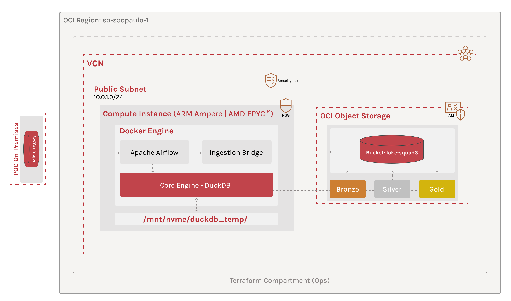

# 🏛️ Data Architecture - Estratégia de Cloud Readiness (OCI Execution)

Este documento detalha a implementação da arquitetura de dados do **Squad 3**, concebida sob o paradigma **Cloud Ready**. A infraestrutura da **Oracle Cloud Infrastructure (OCI)** atua como a plataforma de execução otimizada para o motor de governança e processamento DuckDB.

---

## 🎯 1. Visão Geral da Estratégia: Core & Ops

Para atingir a máxima maturidade arquitetural, separamos a **Inteligência** da **Sustentação**. Essa separação permite que o motor de dados seja agnóstico, enquanto a operação é otimizada para a nuvem através de pilares de **Cloud Readiness**.

*   **🧠 Core (The Engine):** Responsável pela lógica de negócio e transformação. Atua como o **Worker** que executa a arquitetura Medallion e garante a integridade dos dados através de processamento vetorial (DuckDB). É o motor de execução agnóstico à infraestrutura, onde residem os contratos de dados e as regras de qualidade.
*   **🏗️ Ops (The Platform):** Responsável pelo **Provisionamento (IaC)** via Terraform, **Orquestração** via Airflow e **Ingestão Híbrida**. É o que viabiliza a execução do Core com segurança e escalabilidade.

 

> 💡 **Decisão Estratégica de Portabilidade:** Optamos pelo deploy via **Docker Compose dentro de OCI Compute**. Isso garante portabilidade total: o ecossistema pode ser migrado para qualquer nuvem ou ambiente local apenas movendo o arquivo de composição, sem "lock-in" com serviços proprietários.

---

## 🛠️ 2. Fases do Ciclo de Vida Operacional

A execução na OCI foi estruturada em um pipeline de 4 fases totalmente automatizadas:

### **Fase 1: Provisionamento Imutável (Terraform)**
Toda a infraestrutura é erguida via código, garantindo reprodutibilidade:
*   **Networking:** VCN isolada com Subnets públicas e Security Lists configuradas para acesso administrativo (SSH) e operacional (Airflow Webserver).
*   **Identity (IAM):** Implementação de **Dynamic Groups** e **Instance Principals**, permitindo que a VM gerencie objetos no Bucket sem chaves fixas.
*   **Storage:** Bucket `lake-squad3` configurado com API S3-Compatible para integração nativa com DuckDB e Boto3.

### **Fase 2: Bootstrap & Integração (Cloud-Init + Docker)**
No momento do boot da instância, o script `cloud-init.sh` prepara o ambiente:
*   **Stack Docker:** Instalação automatizada do Docker Engine e Docker Compose Plugin para arquitetura ARM64.
*   **Performance Path:** Criação do diretório `/mnt/nvme/duckdb_temp` no host com permissões otimizadas para o motor DuckDB.
*   **Volume Mapping:** O Core é montado como um volume persistente, permitindo atualizações de lógica sem necessidade de redeploy da infraestrutura.

### **Fase 3: Ingestão Híbrida (The Data Bridge)**
A **`dag_ingestion_bridge`** executa o script de migração que conecta o legado à nuvem:
*   **Fluxo:** MinIO (VPS) ➔ OCI Object Storage (Raw).
*   **Tecnologia:** Uso de `upload_fileobj` para transferência via streaming, minimizando o footprint de memória e maximizando o throughput de rede.

### **Fase 4: Orquestração & Injeção de Ambiente**
O Airflow assume o papel de maestro, garantindo a harmonia entre os repositórios:
*   **`dag_core_bootstrap`**: Sincroniza o repositório Core e realiza a **Injeção Dinâmica de Variáveis**. Ela traduz as configurações do Ops para o formato esperado pelo Core, gerando o arquivo `.env` automaticamente.
*   **`dag_core_pipeline`**: Dispara o script unificado `/bin/run_pipeline.sh` do Core, processando as camadas Bronze, Silver e Gold.

---

## 🛡️ 3. Governança e Segurança (Policy as Code)

A arquitetura transporta os pilares de **Cloud Readiness** para a nuvem de forma nativa:

*   **Segurança Zero-Trust:** Uso de *Instance Principals*. A identidade da VM é sua própria credencial de acesso ao Data Lake.
*   **Otimização de Hardware:** Configuração dinâmica de `memory_limit` e `threads` no DuckDB via variáveis de ambiente, aproveitando os 24GB de RAM e 4 OCPUs da instância ARM.
*   **Persistência de Performance:** Mapeamento de volume para o diretório temporário do DuckDB, garantindo que operações de "spill-to-disk" ocorram em alta velocidade e não saturem o container.
*   **Isolamento de Processos:** Separação clara entre logs de orquestração (Airflow) e logs de processamento (Core/DuckDB).

---

## 📈 4. Status da Infraestrutura (Sandbox)

| Recurso | Status | Descrição |
| :--- | :---: | :--- |
| **Identity (IAM)** | 🟢 | Dynamic Groups e Políticas de Instance Principal ativos. |
| **Networking** | 🟢 | VCN, Subnets e Security Lists provisionadas via Terraform. |
| **Object Storage** | 🟢 | Bucket `lake-squad3` operacional (Camadas Medallion). |
| **Compute Instance**| 🟢 | Configurada com Cloud-Init para Docker e DuckDB Temp. |
| **Data Bridge** | 🟢 | Script de ingestão Raw (MinIO → OCI) validado e funcional. |
| **Orchestration** | 🟢 | Airflow configurado com injeção dinâmica de `.env` para o Core. |

---

## 📂 Localização dos Projetos na VM (Cloud Path)

*   **📍 Raiz da Aplicação:** `/home/opc/app/`
*   **⚙️ Camada Ops (Orquestração):** `/home/opc/app/hackathon-pod-squad3-ops/`
*   **🔐 Camada Core (Processamento):** `/home/opc/app/hackathon-pod-squad3-core/`
*   **⚡ Temp Path:** `/mnt/nvme/duckdb_temp` (Mapeado para o Docker)

---

> 🔐 **O Core define O QUE a arquitetura executa.**  
> ⚙️ **O Ops define COMO e ONDE ela é executada.**